# infra-team5
클라우드 3기 프로젝트1 Surbee

---

# 🐝 Surbee - 설문조사 웹 서비스

**Surbee**는 누구나 쉽게 설문을 만들고 공유할 수 있는 설문조사 플랫폼입니다.  
회원/비회원 누구나 응답 가능하며, 실시간으로 결과를 확인할 수 있습니다.

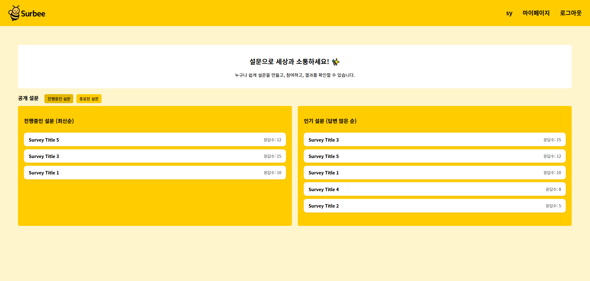

---

## 🚀 주요 기능

### 🔐 인증
- 소셜 로그인 (Google, Kakao) 지원
- OAuth2 기반 로그인 및 사용자 정보 자동 저장

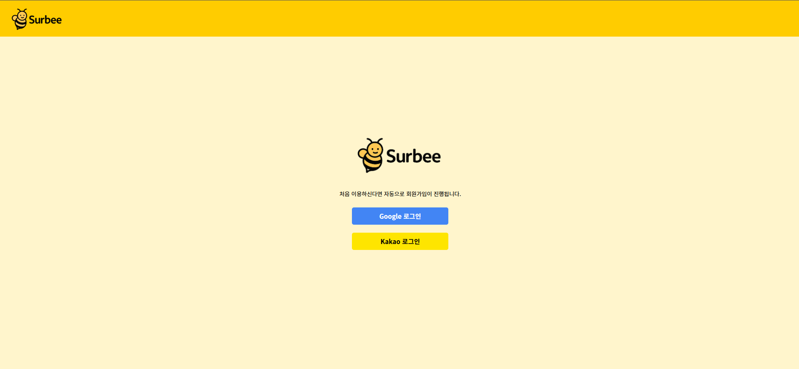

### 📋 설문 생성
- 단일 선택(객관식), 다중 선택(체크박스), 단답형, 장문형 문항 설정
- 공개/비공개 여부 설정 가능 (비공개 시 비밀번호 입력)

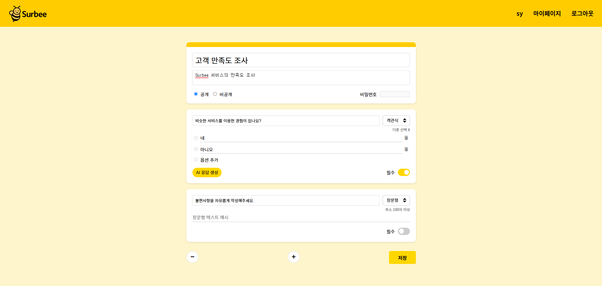

### ✅ 설문 응답
- 로그인 없이도 설문 응답 가능
- 필수 문항 유효성 검사 및 스크롤 이동

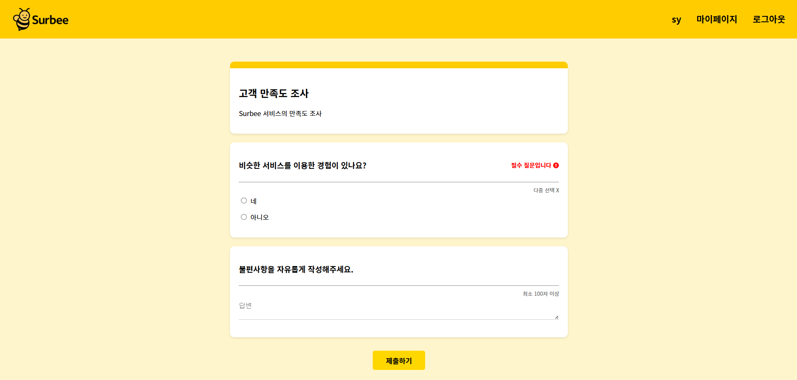

### 📊 설문 결과
- 응답 수 통계 제공
- 객관식 문항 결과 그래프로 시각화

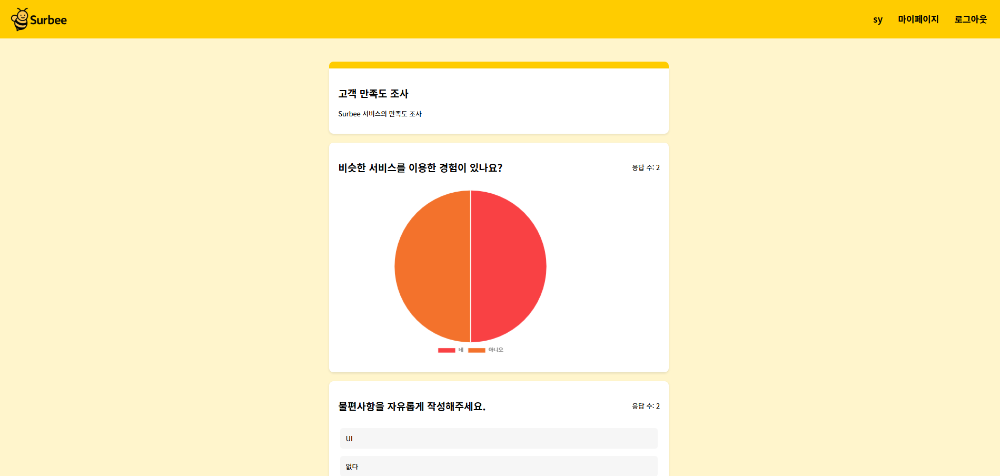

### 🧑‍💼 마이페이지
- 내가 만든 설문 목록 조회
- 설문 삭제 및 종료 기능 제공

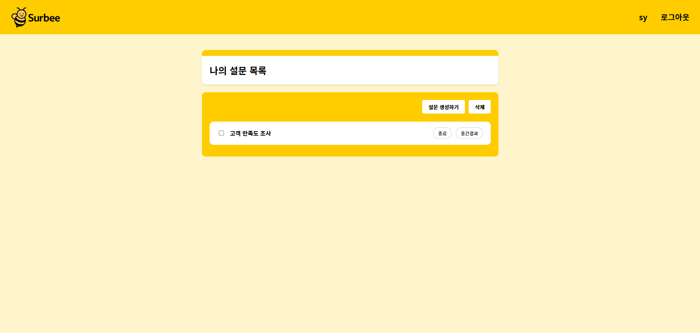

---

## 📡 시스템 구성도

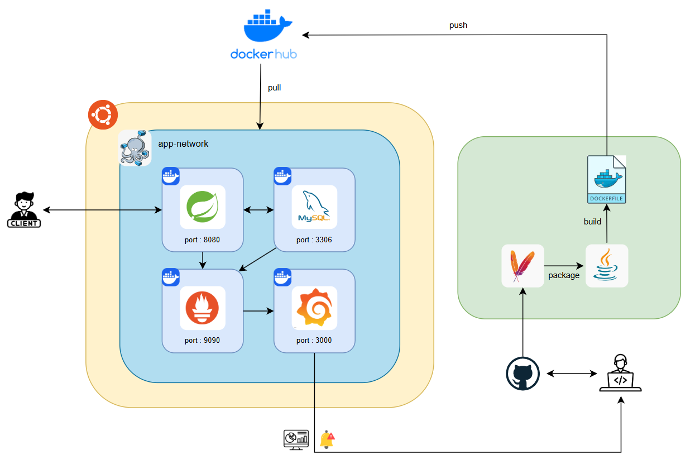

---

## 📈 모니터링

- **Prometheus**: Spring Boot, MySQL 메트릭 수집
- **Grafana**: 대시보드 시각화 및 알림 설정 (이메일 경고 등)
- **mysqld-exporter**: MySQL 지표 수집을 위한 Exporter

### JVM 대시보드

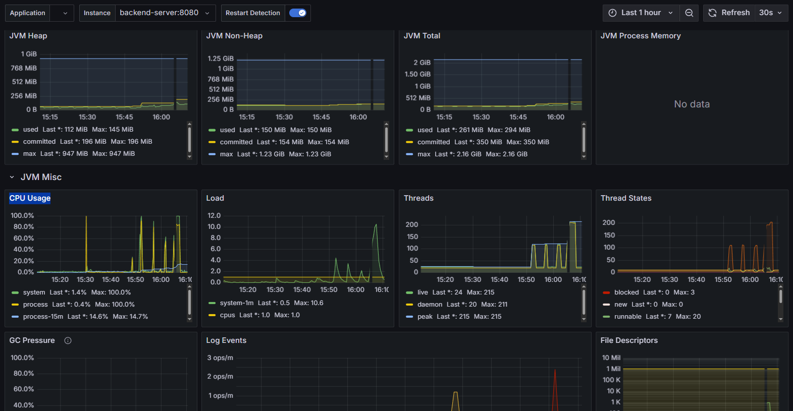

### MySQL 대시보드

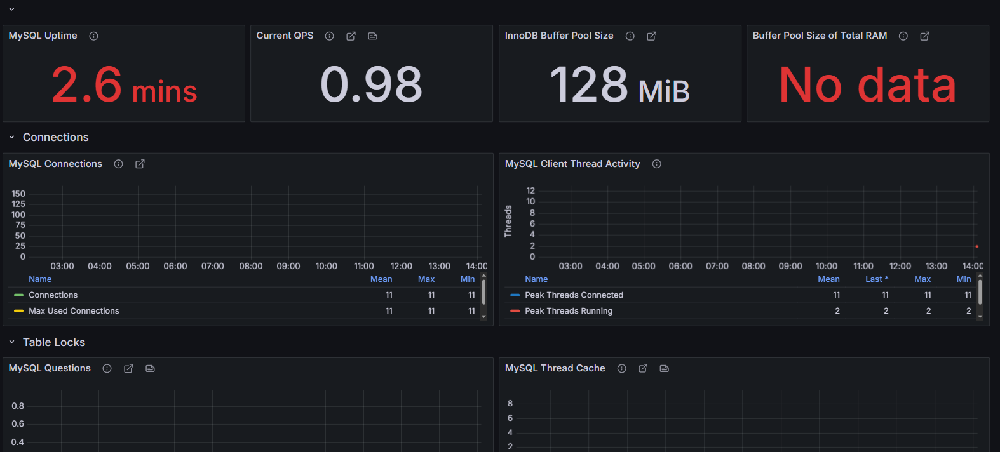

### 🔔 설정된 알람 조건

- **JVM CPU 사용량이 50% 이상**인 상태가 **1분 이상 지속될 경우** → **이메일 알림 전송**
- 향후 확장 가능하도록 경고 임계값/대상별 대시보드 구성 완료

> 📬 Grafana Alert Notification은 Gmail SMTP 연동을 통해 실시간 메일 발송 처리

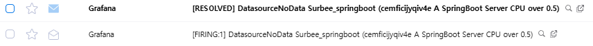

---

## 🛠 기술 스택

| 구성       | 사용 기술                                     |
|------------|-----------------------------------------------|
| **Frontend** | Thymeleaf, HTML/CSS, JavaScript              |
| **Backend**  | Spring Boot, Spring Security, JPA, OAuth2    |
| **DB**       | MySQL                                        |
| **Infra**    | Docker, Docker Compose, Prometheus, Grafana  |
| **CI/CD**    | GitHub, DockerHub                            |

---

## 📦 프로젝트 구조
```
src
├── controller       # 웹 요청 처리
├── dto              # 요청/응답 DTO
├── entity           # JPA 엔티티
├── repository       # JPA 인터페이스
├── service          # 비즈니스 로직
└── templates        # Thymeleaf 뷰
```

---

## 📄 ERD

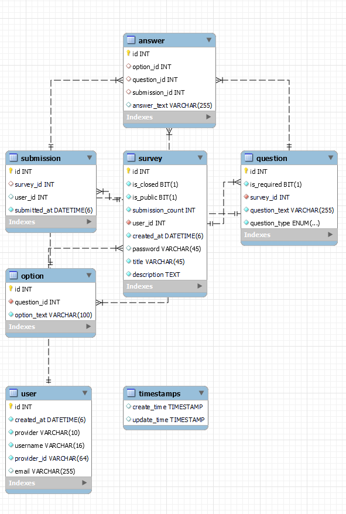

---

## 📬 API 명세

자세한 API 명세는 [API 문서 보기](./docs/api-spec.md) 참고

---

## 👨‍👩‍👧‍👦 팀 소개

| 이름   | 역할                             |
|--------|----------------------------------|
| 조성욱 | 설문 응답 페이지, 백엔드         |
| 박시윤 | 소셜 로그인, 인프라, 모니터링    |
| 천병준 | 설문 생성, 결과 페이지, 백엔드   |
| 김종훈 | 메인페이지, 마이페이지, DB 설계  |

---

## 🧠 회고 및 배운 점

- 백엔드와 프론트 협업 시 API 명세의 중요성 체감
- OAuth2 인증 구조와 Docker Compose 활용한 인프라 구축 경험
- SQL 집계 함수와 Java 타입 매핑 이슈 (ex. `Long` vs `Integer`)
- 기능별 모듈화의 중요성과 협업 기반 개발의 유익함

---

## 📌 실행 방법

```bash
# 1. Docker 이미지 빌드
docker-compose build

# 2. 컨테이너 실행
docker-compose up -d
```
